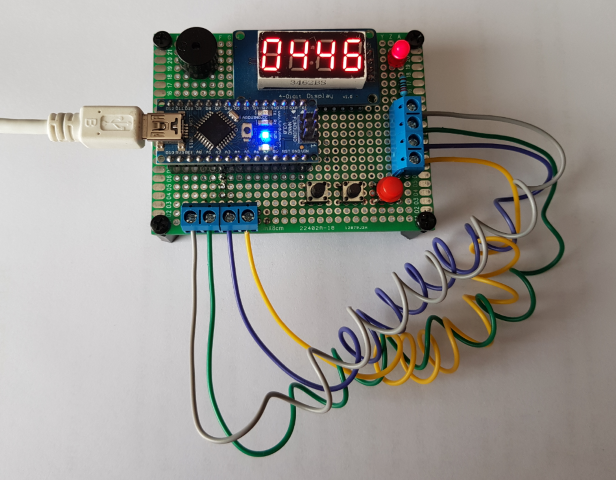
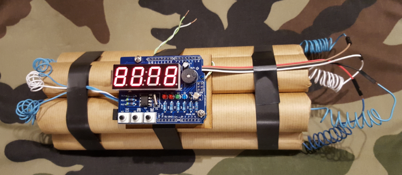
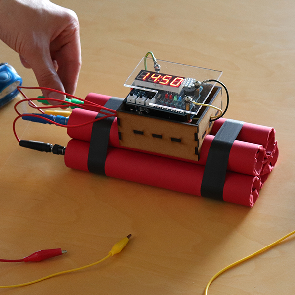
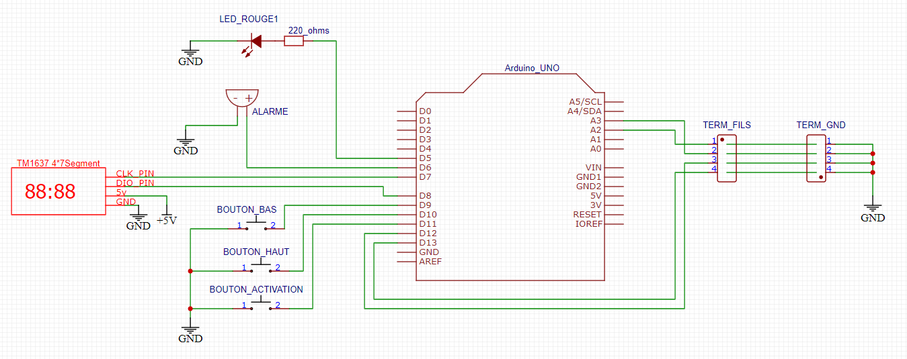

# Bombe arduino n°02
Ce montage permet de simuler une bombe ou une mine pour un jeu de rôle grandeur nature (jdr GN) ou une partie d'airsoft  
C'est une version évoluée de la [bombe n°1](https://github.com/technolarp/bombe01) permettant de désamorcer la bombe grâce à des fils électrique.   
!! CE N'EST PAS UNE VERITABLE BOMBE !! 

## Matériel
Vous aurez besoin de
- une carte Arduino uno ou nano
- un afficheur 4*7segment avec un contrôleur TM1637. [Ce modèle](https://robotdyn.com/4-digit-led-display-tube-7-segments-tm1637-50x19mm-red-double-dots-clock.html) fonctionne bien
- une LED rouge 5v et une résistance appropriée (220 ohms)
- un buzzer piezo 5v
- trois boutons poussoir NO (Normally Open)
- des morceaux de fil électrique et des terminaux à vis. En option, vous pouvez utiliser d'autre type de connecteurs


## Utilisation
1. Rebrancher les fils de désamorçage
1. Allumer la bombe, l'afficheur indique 05:00
1. Appuyer sur le bouton haut ou bas pour régler le compte à rebours
1. Appuyer sur le bouton d'activation
1. La bombe est activée et le temps décompte sur l'afficheur

A la fin du compte à rebours, la bombe "explose". Le buzzer sonne pendant environ 5 secondes et l'afficheur clignote avec le message "b o o n".  
Il est possible de désactiver la bombe en coupant certains fils préalablement configurés  

## Configurer les fils de désamorçage
###  Manuellement
Vous pouvez configurer manuellement les fils de désamorçage dans le code arduino.  
Modifier le array __actionFil[FILS_NB]__ and choisissez l'action à effectuer pour chaque fil.  

Type de fil  |  Action
---------|------------
FIL_SAFE | Change __statutBombe__ pour __BOMBE_SAFE__ et désamorce la bombe
FIL_EXPLOSION | Change __statutBombe__ pour __BOMBE_EXPLOSEE__ et fait exploser la bombe
FIL_DELAI | Divise le délai par 2, le compte à rebours s'écoule plus vite
FIL_NEUTRE | Ne change rien

- Si un fil FIL_SAFE est coupé ou débranché, la bombe est désamorçée et un message "S A F E" apparait sur l'afficheur en alternance avec le temps restant  
- Si un fil FIL_EXPLOSION est coupé ou débranché, la bombe explose. La bombe agit comme si le temps était écoulé et le message "b o o m" apparait sur l'afficheur
- Si un fil FIL_DELAI est coupé ou débranché, le temps décompte plus vite
- Si un fil FIL_NEUTRE est coupé ou débranché, il ne se passe rien

__Exemple 1__  
Le fil connecté sur la pin __A2__ désamorce la bombe, le fil connecté sur la pin __A3__ fait exploser la bombe, le fil connecté sur la pin __12__ accèlere le décompte, le fil connecté sur la pin __13__ ne fait rien

```c
// DEFINITION DES ACTIONS POUR CHAQUE FIL
byte actionFil[FILS_NB] = {
  FIL_SAFE,       // fil 1 connecte sur la pin A2
  FIL_EXPLOSION,  // fil 2 connecte sur la pin A3
  FIL_DELAI,      // fil 3 connecte sur la pin 12
  FIL_NEUTRE      // fil 4 connecte sur la pin 13
  };
```
###  Répartition aléatoire
Vous pouvez configurer les fils de désamorçage en mode aléatoire. Modifier le array __actionFil[FILS_NB]__ and choisissez l'action __FIL_ALEATOIRE__.
Au démarrage de la bombe, le code arduino affectera une action à chaque fil aléatoire dans la fonction ```void affecteFilsAleatoires()```.  
Le code essayera de satisfaire les paramètres donnés dans les variables suivantes, dans cet ordre :  
D'abord les __nbFilExplosion__, puis les __nbFilSafe__ et enfin les __nbFilDelai__  
S'il reste des fils non affectés, il le seront avec l'action __FIL_NEUTRE__.  

__Exemple 2__  
Dans cet exemple, les 4 fils seront choisis aléatoirement.  
1 fil fera exploser la bombe, 1 fil désamorcera la bombe, les 2 autres accélèreront le décompte  
```c
// DEFINITION DES ACTIONS POUR CHAQUE FIL
byte actionFil[FILS_NB] = {
  FIL_ALEATOIRE,  // fil 1 connecte sur la pin A2
  FIL_ALEATOIRE,  // fil 2 connecte sur la pin A3
  FIL_ALEATOIRE,  // fil 3 connecte sur la pin 12
  FIL_ALEATOIRE   // fil 4 connecte sur la pin 13
  };

// repartition des fils aleatoires
byte nbFilExplosion = 1;
byte nbFilSafe = 1;
byte nbFilDelai = 2;
```
### Mélanger les fils manuels et aléatoires
Vous pouvez mélanger les fils manuels et les fils aléatoires. Seuls les __FIL_ALEATOIRE__ seront remplacés par une action comme dans l'exemple 2  

__Exemple 3__  
Dans cet exemple, le fil 3 connecté sur la pin __12__ fera exploser la bombe. 
1 fil fera exploser la bombe, 1 fil désamorcera la bombe et le dernier fil aléatoire accélèrera le décompte  
```c
// DEFINITION DES ACTIONS POUR CHAQUE FIL
byte actionFil[FILS_NB] = {
  FIL_ALEATOIRE,  // fil 1 connecte sur la pin A2
  FIL_ALEATOIRE,  // fil 2 connecte sur la pin A3
  FIL_EXPLOSION,  // fil 3 connecte sur la pin 12
  FIL_ALEATOIRE   // fil 4 connecte sur la pin 13
  };

// repartition des fils aleatoires
byte nbFilExplosion = 1;
byte nbFilSafe = 1;
byte nbFilDelai = 2;
```

## Utiliser plus ou moins de fils
Ce code arduino est adapté au [shield tick tock de chez Seedstudio](https://www.seeedstudio.com/Starter-Shield-EN-Tick-Tock-shield-v2-p-2768.html) mais il est tout à fait possible de s'en passer et d'utiliser un afficheur 4*7 segments avec contrôleur TM1637  
Il est également possible dans ce cas d'ajouter ou de retirer des fils de désamorçage. Vous pouvez aussi utiliser d'autre pin de la carte arduino. Il suffit de modifier les paramètres dans l'entête du code arduino
```c
// FILS DE DESAMORCAGE
#define FILS_NB 4
byte pinFils[FILS_NB] = {A2, A3, 12, 13};
```
  
__Exemple 4__   
Pour utiliser 6 fils de désamorcage sur les pins 2, 3, 4, 12, 13 et A0, il faut adapter le code ainsi :
```c
// FILS DE DESAMORCAGE
#define FILS_NB 6
byte pinFils[FILS_NB] = {2, 3, 4, 12, 13, A0};
```

et penser à affecter une action au choix à chaque fil  
```c
// DEFINITION DES ACTIONS POUR CHAQUE FIL
byte actionFil[FILS_NB] = {
  FIL_SAFE,       // fil 1 connecte sur la pin 2
  FIL_EXPLOSION,  // fil 2 connecte sur la pin 3
  FIL_DELAI,      // fil 3 connecte sur la pin 4
  FIL_SAFE,       // fil 4 connecte sur la pin 12
  FIL_EXPLOSION,  // fil 5 connecte sur la pin 13
  FIL_DELAI       // fil 6 connecte sur la pin A0
  };
```


## Bibliothèque
Vous aurez besoin d'installer la bibliothèque [TM1637Display.h](https://github.com/avishorp/TM1637)  

Cette library esy disponible via l'IDE arduino dans le library manager. menu Sketch->Include Library->Manage Libraries... Chercher la library "tm1637 by Avishay Orpaz".  
Cette library est aussi disponible sur [github](https://github.com/avishorp/TM1637)  

## Exemples
  
Prototype avec un Arduino Nano et 2 terminaux à vis 4 bornes
  
  
Une bombe compléte à base d'un Arduino Uno et d'un [shield tick tock de chez Seedstudio](https://www.seeedstudio.com/Starter-Shield-EN-Tick-Tock-shield-v2-p-2768.html), avec des connecteurs dupont femelle et du fil électrique rigide  

  
Un autre exemple plus abouti pour un escape game.  
Les 4 fils de désamorçage sont sur la gauche, les connecteur sont des fiches bananes. Les fils sur le haut de la bombe sont décoratifs.   
Réalisation basée sur une carte arduino uno et un  [shield tick tock de chez Seedstudio](https://www.seeedstudio.com/Starter-Shield-EN-Tick-Tock-shield-v2-p-2768.html)   
Le boitier est fait de mdf et de plexiglas PMMA découpés au laser


## Câblage
Pin Arduino  | Composant | Commentaire
---------|------------|------------
D5 |   LED_ROUGE_PIN |   led rouge + resistance
D6 |   ALARME_PIN  |   buzzer piezo 5v
D7 |   CLK_PIN |   TM1637 pin CLK
D8 |   DIO_PIN |   TM1637 pin DIO
D9 |   BOUTON_BAS_PIN |  bouton haut
D10 |  BOUTON_HAUT_PIN | bouton bas
D11 |  BOUTON_ACTIVATION_PIN | bouton d'activation
A2 |    FILS_PIN[0]            |   fil de deminage n°1
A3 |    FILS_PIN[1]            |   fil de deminage n°2
D12 |   FILS_PIN[2]            |   fil de deminage n°3
D13 |   FILS_PIN[3]            |   fil de deminage n°4

 

## Schema 


TERM_FILS et TERM_GND sont des terminaux à vis 4 bornes. Il faut simplement utiliser un morceau de fil électrique entre les bornes de chaque terminal (voir [exemple 1](https://github.com/technolarp/bombe02/blob/master/images/bombe02_exemple01.png)).  
Il est possible d'utiliser d'autre type de connecteur comme des interripteurs on/off, ou encore des fiches banane ou des connecteurs dupont (voir les exemples)  

## Alimentation
Il existe plusieurs façons d'alimenter une carte Arduino Uno.  
[Quelques explications](https://www.open-electronics.org/the-power-of-arduino-this-unknown/)
1. câble USB, 5v
1. fiche DC 2.1mm, de 6-12v
1. pin 5v, 5v
1. pin Vin, de 6-12v
