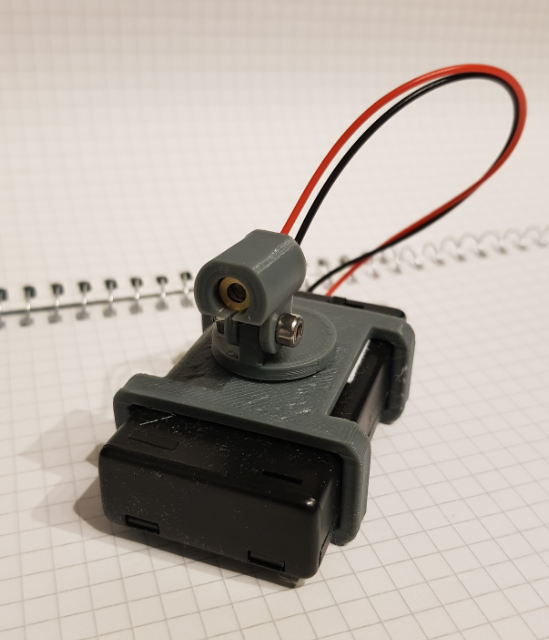
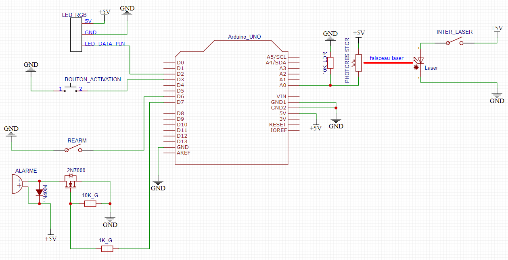

# Mine laser n°01
Ce montage permet de simuler une bombe/mine laser pour un jeu de role grandeur nature (jdr GN) ou une partie d'airsoft  
!! CE N'EST PAS UNE VERITABLE BOMBE !! 

## Matériel
Vous aurez besoin de
- une carte Arduino uno ou nano
- un photoresistor et d'une résistance 10 kOhms
- une diode laser 5v
- une alarme 5-12v et 1 mosfet 2N7000
- une LED neopixel ou ws2811
- une bouton poussoir NO (Normally Open)
- un jumper de carte mere de PC ou un interrupteur on/off


## User manual
1. Allumer la mine, la led clignote en vert lentement
1. Aligner le laser et le photoresistor
1. Appuyer sur le bouton d'activation
1. La mine calibre le photoresistor pendant environ 5 secondes
1. La mine est activée et la led clignote lentement en rouge

Si quelqu'un coupe le laser, la mine "explose". La led clignote en rouge rapidement et l'alarme sonne pendant environ 5 secondes.  
Si le jumper de rearmement automatique est présent, la mine se réarme toute seule  
Il n'est pas possible de désactiver la mine, sauf en l'éteignant  

Une fois la mine "explosée", la led clignote en bleu lentement

## Bibliothèque
Vous aurez besoin d'installer la bibliothèque [FastLED.h](https://github.com/FastLED/FastLED)  

Remarque :  
Pour utiliser une led ws2811, décommenter la ligne  
```FastLED.addLeds<WS2811, LED_DATA_PIN>(leds, NB_LEDS);```  
Pour utiliser une led neopixel de chez Adafruit, décommenter la ligne  
```FastLED.addLeds<NEOPIXEL, LED_DATA_PIN>(leds, NB_LEDS);```  


## Exemples
  
Mine laser réalisée avec une carte Arduino Nano et un pcb de prototypage
J'ai utilisé une alarme 6-12V pour moto : https://www.aliexpress.com/item/32221510247.html  
  
  
Le laser est avec un bloc de 3 piles AAA et un interrupteur, le support est imprimé en PLA
  
  
Le support du photoresistor est aussi imprimé en PLA. L'écran de diffusion est en scotch de peintre blanc


## Câblage
Pin Arduino  | Composant | Commentaire
---------|------------|------------
A0 | PHOTORESISTOR_PIN | photoresistor résistance pulldown 10 kOhms
D2 | LED_DATA_PIN | led RGB neoPixel ou ws2811
D3 | BOUTON_ACTIVATION_PIN | bouton d'activation
D6 | REARM_PIN | réarmement automatique de la mine
D7 | ALARME_PIN | mosfet et alarme

## Schema 


Les deux résistances et la diode sont là pour protéger le mosfet et la carte Arduino

## Alimentation
Il existe plusieurs façons d'alimenter une carte Arduino Uno.
[Quelques explications](https://www.open-electronics.org/the-power-of-arduino-this-unknown/)
1. câble USB, 5v
1. fiche DC 2.1mm, de 6-12v
1. pin 5v, 5v
1. pin Vin, de 6-12v
