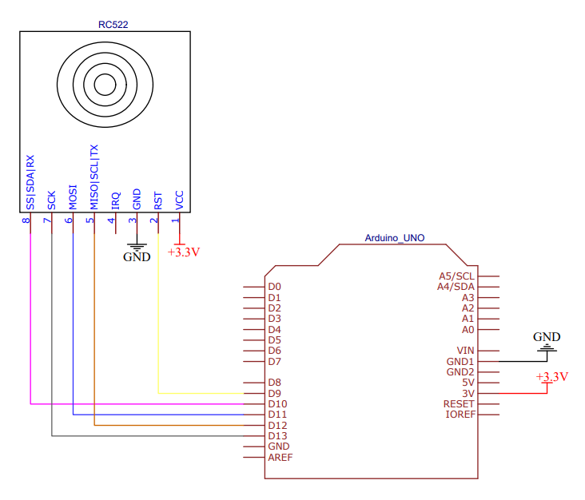

# Scanner RFID
Ce montage permet de lire des tags RFID et d'écrire leur UID sur la sortie Serial de l'arduino.  
Le but est d'interfacer le lecteur de tag RFID avec [LAnimaRP](https://github.com/lvanhee/LAnimaRP) pour simuler un scanner d'identification. Durant le jeu, des objets avaient un tag RFID et LAnimaRP permettait de donner des informations sur ces objets.  

J'ai utilisé un soft gratuit ([232key](https://www.232key.com/versions/free.html)) pour lire le port COM du PC et similer un clavier pour "écrire" l'UID du tag directement dans l'interface de LAnimaRP.  
La version free est limitée en fonctionnalités mais permet d'utiliser correctement le scanner RFID

## Matériel
Vous aurez besoin
- d'une carte Arduino uno ou nano
- d'un lecteur RFID RC522
- un câble USB
- un PC sous windows
- du soft 232key
- de LAnimaRP

## User manual
1. Brancher l'arduino sur un port USB du PC
1. Démarrer 232key
1. Démarrer LAnimaRP
1. scanner un tag RFID

## Bibliothèque
Vous aurez besoin d'installer la bibliothèque [MFRC522.h](https://github.com/miguelbalboa/rfid)  

## Configuration
232key est simple à configurer
  
  
  

## Schema 

