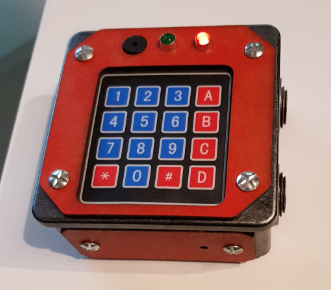
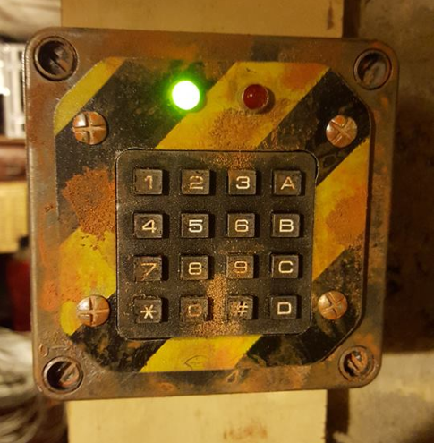
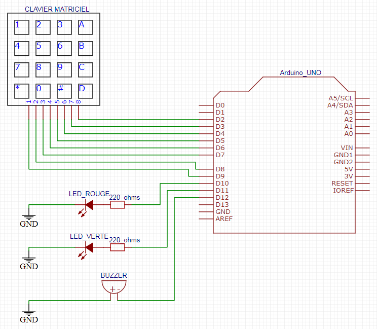

# Serrure à clavier matriciel n°01
Ce montage permet de créer une serrure à clavier matriciel pour le jeu de rôle Grandeur Nature (jdr GN) &amp; l'airsoft, à base d'arduino  

- si la led rouge est allumée, la serrure est fermée
- si la led verte est allumée, la serrure est ouverte  
  
Cette serrure ne ferme pas "physiquement", c'est un simulateur

## Matériel
Vous aurez besoin de
- une carte Arduino uno ou nano
- un clavier matriciel 4x4
- un buzzer piezo 5V
- une led rouge 5V et une led verte 5V, avec leur résistance appropriées (220 Ohms)


## Utilisation
1. Alimenter la serrure
1. La led rouge s'allume, la serrure est en mode fermé

Pour ouvrir la serrure, il faut entrer le bon code à quatre caractères suivi de la touche "\*" ou "#".
Les caractères sont à choisir parmi les 10 chiffres (0 à 9) et les 4 premières lettres (A B C D).

Par défaut le code est "1 2 3 4". Il peut être modifier dans cette partie du code arduino :
```c
// CODE DE LA SERRURE
char codeSerrure[4]={'1','2','3','4'};
```

Après trois erreurs de code, la serrure se bloque pendant 30 secondes. Les leds cligontent alternativement.
Ces paramétres sont modifiables dansle code arduino :
```c
// BLOCAGE DE LA SERRURE
int erreurCodeMax = 3;
int tempoBlocage = 30;
```

## Bibliothèque
Vous aurez besoin d'installer la bibliothèque [keypad.h](https://playground.arduino.cc/Code/Keypad/)  

Cette library est disponible via l'IDE arduino dans le library manager. menu Sketch->Include Library->Manage Libraries... Chercher la library "keypad by Mark Stanlet, Alexander Brevig".  
Cette library est aussi disponible sur [playground](https://playground.arduino.cc/Code/Keypad/)  


## Exemples
  
Une serrure réalisée avec une boîte de dérivation  

  
Une serrure réalisée pour un GN ambiance post-apo. Le buzzer est à l'intérieur
  


## Câblage
Pin Arduino  | Composant | Commentaire
---------|------------|------------
D2     |   KEYPAD PIN 8     |     clavier matriciel
D3     |   KEYPAD PIN 7     |     clavier matriciel
D4     |   KEYPAD PIN 6     |     clavier matriciel
D5     |   KEYPAD PIN 5     |     clavier matriciel
D6     |   KEYPAD PIN 4     |     clavier matriciel
D7     |   KEYPAD PIN 3     |     clavier matriciel
D8     |   KEYPAD PIN 2     |     clavier matriciel
D9     |   KEYPAD PIN 1     |     clavier matriciel
D10    |   LED_ROUGE_PIN    |    led rouge + resistance 220 Ohms
D11    |   LED_VERTE_PIN    |    led verte + resistance 220 Ohms
D12    |   BUZZER_PIN       |    buzzer piezo 5v

Il faut bien respecter l'ordre de branchement des pin du clavier !
 
## Schema 



## Alimentation
Il existe plusieurs façons d'alimenter une carte Arduino Uno.
[Quelques explications](https://www.open-electronics.org/the-power-of-arduino-this-unknown/)
1. câble USB, 5v
1. fiche DC 2.1mm, de 6-12v
1. pin 5v, 5v
1. pin Vin, de 6-12v
